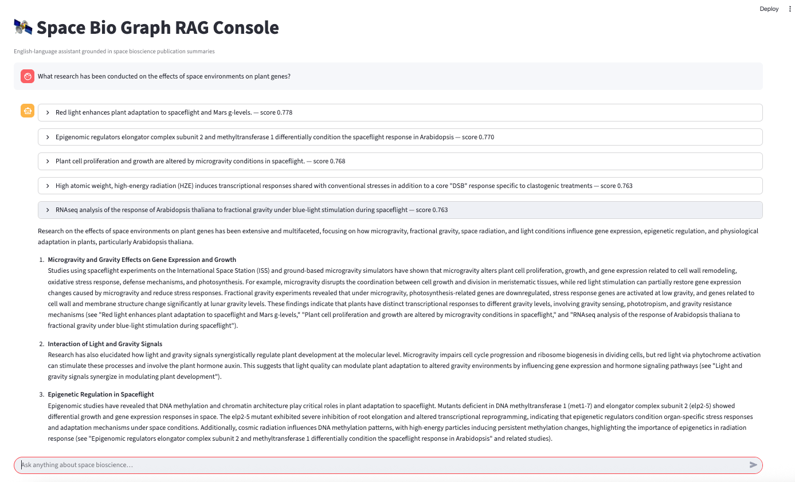
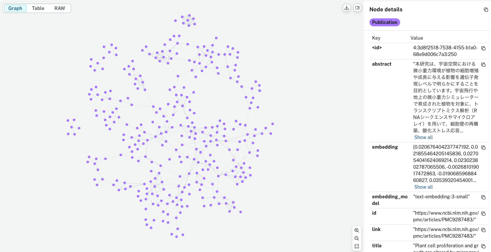

# Space Bio Graph RAG




Graph-based Retrieval Augmented Generation (RAG) workflow for the NASA space bioscience publication dataset. The project enriches a publication CSV with GPT-generated abstracts, stores the results in a Neo4j knowledge graph, and exposes a space-themed Streamlit chatbot capable of answering questions in English while citing the supporting literature.

## Features

- **Abstract augmentation** – `augment_publications.py` pulls each publication from the CSV, extracts salient context, and creates a Japanese abstract via OpenAI Responses API (configurable model/fallbacks).
- **Graph ingestion** – `graph_ingest.py` embeds every abstract, writes `Publication` nodes to Neo4j, and creates `SIMILAR_TO` relationships using cosine similarity with top-*k* neighbours.
- **Graph RAG chatbot** – `rag_chat.py` serves a Streamlit UI that retrieves relevant nodes with Neo4j vector search, expands neighbourhood context, and crafts an English answer with inline citations.
- **Configurable secrets** – credentials are read from environment variables or the git-ignored `secrets/.env`, keeping sensitive data out of version control.

## Repository Layout

```
.
├── augment_publications.py      # GPT-powered abstract generator
├── graph_ingest.py              # Neo4j ingestion pipeline + similarity edges
├── rag_chat.py                  # Streamlit Graph RAG chatbot (English UI)
├── test_neo4j_connection.py     # Quick connectivity smoke test
├── RAG_SETUP.md                 # Detailed setup & operations guide (JP)
├── secrets/
│   └── .env.example             # Copy to secrets/.env and fill with real credentials
├── SPACE_GraphRAG_screenshot.png
├── Graph_Knowledge_Sample.png
└── README.md
```

## Prerequisites

- Python 3.11
- OpenAI API access for Responses + Embeddings endpoints
- Neo4j AuraDB (or self-hosted) with vector indexing enabled

## Setup

1. **Create the virtual environment and install dependencies**
   ```bash
   python3 -m venv .venv
   source .venv/bin/activate
   pip install --upgrade pip
   pip install -r requirements.txt
   ```
   *(If the project has already been set up, simply run `source .venv/bin/activate`.)*

2. **Configure secrets**
   ```bash
   cp secrets/.env.example secrets/.env
   # edit secrets/.env and set OPENAI_API_KEY, NEO4J_URI, NEO4J_USERNAME, NEO4J_PASSWORD, NEO4J_DATABASE
   ```
   You can also export the same keys as environment variables; the scripts prioritise env vars over `secrets/.env`.

3. **Verify Neo4j connectivity**
   ```bash
   source .venv/bin/activate
   python test_neo4j_connection.py
   ```
   The script prints `Connected via Bolt as <username>` when authentication succeeds.

## Usage

1. **Generate abstracts (once per dataset update)**
   ```bash
   source .venv/bin/activate
   python augment_publications.py --sleep 1.2
   ```
   Options:
   - `--overwrite` re-creates abstracts even if they already exist.
   - `--model` lets you switch to a different OpenAI Responses model.

2. **Ingest into Neo4j**
   ```bash
   python graph_ingest.py --sleep 0.4 --database "$NEO4J_DATABASE"
   ```
   Useful flags:
   - `--similar-k` sets the number of neighbours for similarity edges.
   - `--wipe` clears existing `Publication` nodes before loading.
   - `--dry-run` previews actions without touching Neo4j.

3. **Launch the Graph RAG chatbot**
   ```bash
   python -m streamlit run rag_chat.py
   ```
   Visit the local URL shown in the terminal and ask questions in English. The app displays the retrieved publications and related neighbours so you can double-check the evidence behind each answer.

## Maintenance Tips

- Regenerate embeddings and rerun ingestion whenever abstracts, embeddings model, or similarity parameters change.
- Keep `secrets/.env` untracked (already enforced via `.gitignore`). Share only the `.env.example` template.
- To capture new screenshots, update the PNG files under the repository root—the README displays them directly.

## License

This repository is intended for internal NASA development use. Add an explicit license here if you plan to publish it publicly.
